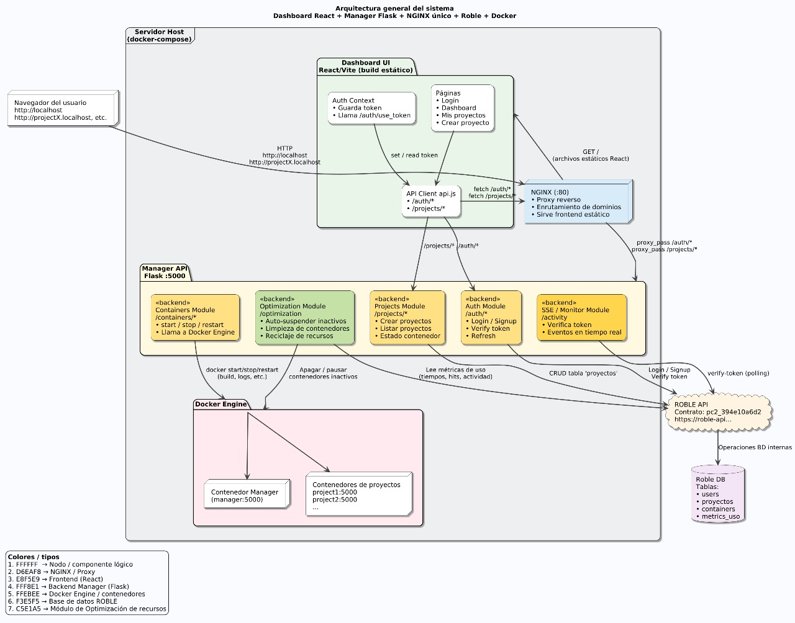

# Cómo ejecutar el proyecto Hosting

Sigue estos pasos para correr el proyecto en cualquier computador con Docker instalado.

---

## 1️⃣ Clonar el repositorio

```bash
git clone https://github.com/andresgomez2310/Hosting.git
cd Hosting
```

---

## 2️⃣ Crear el archivo `.env` dentro de la carpeta root

Dentro de la carpeta root, crea un archivo llamado:

```
.env
```

Con el siguiente contenido:

```
ROBLE_URL=https://roble-api.openlab.uninorte.edu.co
ROBLE_CONTRACT=pc2_394e10a6d2
```

> Este archivo **es obligatorio** para que el backend funcione.

---

## 3️⃣ Ejecutar el proyecto con Docker

Desde la raíz del repositorio, ejecuta:

```bash
docker compose up --build
```

Esto descargará las imágenes necesarias, construirá el frontend, backend y proxy, y levantará todo el sistema.

---

Una vez que los contenedores estén arriba, abre en tu navegador:

```
http://localhost/login
```


## 4️⃣ Acceder a la aplicación
## 🧩 Informe
Este informe presenta la arquitectura, el funcionamiento y las estrategias implementadas en la plataforma de hosting académico basada en Docker, junto con la participación de cada integrante del equipo en su desarrollo.

[📄 Ver Informe Técnico (PDF)](./Hosting%20(1).pdf)

## 🧩 Diagrama de Arquitectura

El siguiente diagrama resume la arquitectura general de la plataforma, mostrando la interacción entre el dashboard, el backend, el reverse proxy y los contenedores Docker desplegados para cada proyecto.


